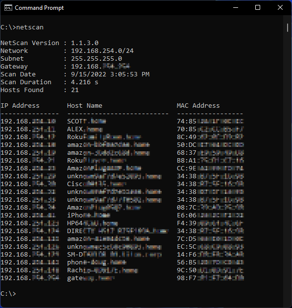

# NetScan
Utility for finding connected devices on your LAN

## ABOUT
NetScan is a command line tool that searches your local network for connected evices.  There are many great and far more robust tools for such a task (for example: https://nmap.org/) that I highly recommend you check out.
However, I wrote this for two reasons:

1. Nmap wasn't always returning host names, even when I tried to force it.
2. I wanted the output in a clean, easy-to-read table.

## USAGE
Currently there are no command-line arguments or parameters.  Just go to the folder where you installed it, typically something like:

> C:\Program Files (x86)\ReardenTools\NetScan

Then run `netscan.exe.`  I do recommend you add the installation folder to your computer's `PATH` variable so that you can run the command from anywhere.

## CREDIT
The tool uses the excellent package IPNetwork by Luc Dvchosal for some of the network discovery tasks.  Thank you for making your hard work available!  Check it out at https://github.com/lduchosal/ipnetwork
